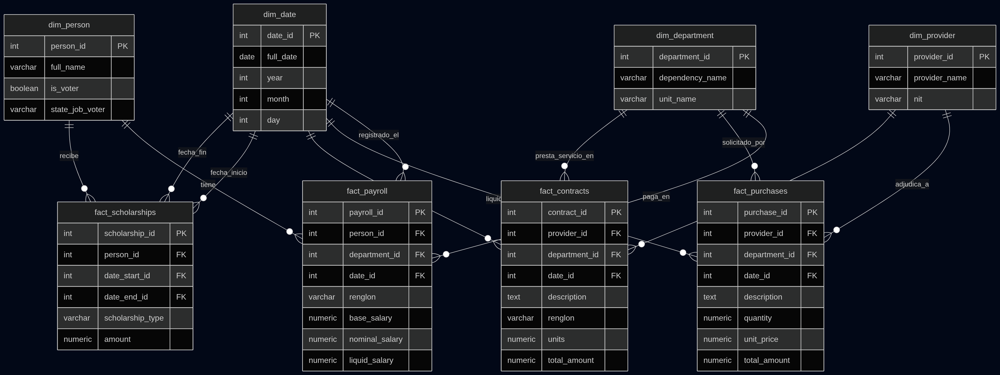

# Análisis de Inteligencia de Negocios: Redes de Clientelismo en la USAC (2021-2026)

**Autor:** Alexander Tzoc Alvarado

**Curso:** Seminario de Sistemas 2

**Stack Tecnológico:** Python (Pandas, Requests) | PostgreSQL | Apache Superset

**Repositorio:** [Repositorio de Github](https://github.com/Achess01/usac-bi-corrupcion-ss2)

---

## Introducción
Este proyecto de Inteligencia de Negocios (BI) analiza y cruza datos públicos para identificar posibles patrones de clientelismo, nepotismo y pago de favores durante la administración del rector Walter Mazariegos en la Universidad de San Carlos de Guatemala (USAC). 

A través de la extracción automatizada y consolidación de datos en un Data Warehouse (PostgreSQL), se visualizan (Apache Superset) las relaciones entre los electores del Colegio Electoral Universitario de 2022, las nóminas salariales y las compras directas adjudicadas.

---

## 1. Fase de Descubrimiento

### 1.1 Hipótesis del Negocio
* **Hipótesis A:** Los integrantes del Colegio Electoral Universitario que votaron por la planilla "Innovación y Desarrollo" han recibido incrementos salariales o nuevas contrataciones (Renglón 029) tras la toma de posesión.
* **Hipótesis B:** Existen proveedores de compras directas en Guatecompras vinculados directamente con autoridades o personal administrativo de la USAC.

### 1.2 Mapeo y Origen de Datos
* **Electores (Colegio Electoral 2022):** Datos extraídos de investigaciones periodísticas (Plaza Pública) y actas públicas.
* **Nóminas y Contratos USAC:** Portal de Información Pública de la USAC.
* **Adjudicaciones del Estado:** Portal de Datos Abiertos OCDS de Guatecompras.

### 1.3 Perfilado de Datos y Retos Técnicos
> **Nota Técnica:** Se documenta un hallazgo importante respecto a la transparencia institucional. El portal de la USAC no permite descargas directas ni tiene URLs estáticas. La información está oculta tras un formularios dinámicos. 
* **Solución aplicada:** Se realizó ingeniería inversa a la petición HTTP y se construyó un script en Python (`requests`) que inyecta los *payloads* del formulario (ej. `anyo=2024`) para forzar la respuesta del servidor y extraer las tablas HTML directamente.
* **Calidad de los datos:** .

### 1.4 Scraping de Datos

#### Compras directas
Durante esta fase se revisó el comportamiento de la fuente y se aplicaron mejoras puntuales al flujo actual:

1. **Encabezados desde la tabla origen**
   - Se configuró la lectura de tablas HTML para usar la primera fila como encabezado real.
   - Implementación: `pd.read_html(StringIO(respuesta.text), header=0)`.
   - Resultado: los nombres de columnas en el DataFrame coinciden con los encabezados oficiales del sitio.

2. **Exportación CSV con separador punto y coma**
   - Se actualizó la escritura de CSV para usar `sep=";"`.
   - Implementación: `df_compras.to_csv(csv_file, sep=";", index=False)`.
   - Resultado: mejor compatibilidad con herramientas de hoja de cálculo en configuraciones regionales hispanohablantes.

#### Contrataciones de bienes y servicios
Se incorporó un nuevo script de extracción para el módulo de contrataciones de bienes y servicios de la USAC.

1. **Nuevo endpoint y cobertura de años**
   - Endpoint utilizado: `https://www3.usac.edu.gt/cip/muestra11.php`.
   - Años de extracción: `2023`, `2024`, `2025` y `2026`.
   - Script implementado: `scraper/contrataciones_bienes_servicios.py`.

2. **Lectura de encabezados desde la tabla fuente**
   - Se usa la primera fila HTML como encabezados reales.
   - Implementación: `pd.read_html(StringIO(respuesta.text), header=0)`.

3. **Exportación en CSV con punto y coma**
   - Se mantiene `sep=";"` para compatibilidad regional.
   - Implementación: `df_contrataciones.to_csv(csv_file, sep=";", index=False)`.
   - Nombre de salida por año: `contrataciones_bienes_servicios_usac_{year}.csv` en `data/raw/`.

#### Becas
Se incorporó un nuevo script de extracción para el módulo de becas de la USAC.

1. **Nuevo endpoint y cobertura de años**
   - Endpoint utilizado: `https://www3.usac.edu.gt/cip/muestra15.php`.
   - Años de extracción: `2022`, `2023`, `2024` y `2025`.
   - Script implementado: `scraper/becas.py`.

2. **Lectura de encabezados desde la tabla fuente**
   - Se usa la primera fila HTML como encabezados reales.
   - Implementación: `pd.read_html(StringIO(respuesta.text), header=0)`.

3. **Exportación en CSV con punto y coma**
   - Se mantiene `sep=";"` para compatibilidad regional.
   - Implementación: `df_becas.to_csv(csv_file, sep=";", index=False)`.
   - Nombre de salida por año: `becas_usac_{year}.csv` en `data/raw/`.

#### Nóminas de pago
Se incorporó un script específico para extraer nóminas mensuales de pago desde el portal de la USAC.

1. **Endpoint y parámetros del formulario**
   - Endpoint utilizado: `https://www3.usac.edu.gt/cip/muestra4tb.php`.
   - Parámetros enviados en `datos_formulario`:
     - `tipo=1`
     - `mes` con valores de `1` a `12`
     - `anyo` con valores de `2022` a `2026`
   - Script implementado: `scraper/nominas_pago.py`.

2. **Extracción mensual por año**
   - Se recorre cada combinación año-mes para obtener un corte mensual independiente.
   - Se utiliza `pd.read_html(StringIO(respuesta.text), header=0)` para respetar los encabezados de tabla de origen.

3. **Salida en archivos separados por período**
   - Se genera un CSV por cada combinación año-mes con separador punto y coma (`sep=";"`).
   - Formato de archivo: `nominas_pago_usac_{year}_{month:02d}.csv`.
   - Ruta de salida: `data/raw/`.

---

## 2. Fase de Preparación

### 2.1 Proceso de ETL (Extracción, Transformación y Carga)
El proceso de limpieza se implementó con **Python (Pandas)** y se organiza en scripts dedicados dentro del directorio `clean/`.

#### Limpiezas implementadas

1. **Votantes (Plaza Pública)**
   - Script: `clean/limpiar_votantes.py`.
   - Transformaciones:
     - Eliminación de tildes y normalización de espacios.
     - Conversión a mayúsculas.
     - Reordenamiento de nombres a formato **APELLIDOS NOMBRES**.
     - Conservación de conectores de apellido (`DE`, `DEL`, `LA`, `VON`, etc.).
   - Salida: `data/clean/votantes_mazariegos_plazapublica_clean.csv`.

2. **Nóminas de pago**
   - Script: `clean/limpiar_nominas.py`.
   - Transformaciones:
     - Conversión de columnas monetarias a tipo numérico.
     - Separación de `MES DE PAGO` en `mes_pago` y `anio_pago`.
     - Adición de `mes_archivo` y `anio_archivo` a partir del nombre del archivo.
     - Regla de calidad: `flag_periodo_inconsistente` cuando el período del registro no coincide con el del archivo.
     - Normalización de empleado en columna auxiliar `EMPLEADO_NORM`.
   - Salidas: `data/clean/nominas_pago_usac_YYYY_MM_clean.csv`.

3. **Compras directas**
   - Script: `clean/limpiar_compras_directas.py`.
   - Transformaciones:
     - Conversión de columnas numéricas (`CANTIDAD`, `PRECIO UNITARIO`, `PRECIO TOTAL`).
     - Parseo de `FECHA LIQUIDACION` a fecha.
     - Regla de calidad por año: `flag_anio_inconsistente`.
     - Normalización de texto en columnas clave y `NIT_NORM` para cruces.

4. **Contrataciones de bienes y servicios**
   - Script: `clean/limpiar_contrataciones_bienes_servicios.py`.
   - Transformaciones:
     - Conversión de montos a tipo numérico.
     - Parseo de `FECHA` (formato `dd/mm/yy`).
     - Regla de calidad por año: `flag_anio_inconsistente`.
     - Normalización de proveedor y `NIT_PROVEEDOR_NORM` para homologación.

5. **Becas**
   - Script: `clean/limpiar_becas.py`.
   - Transformaciones:
     - Conversión de `MONTO` a numérico.
     - Parseo de `FECHA DE INICIO` y `FECHA FIN`.
     - Regla de calidad temporal: `flag_fechas_invertidas`.
     - Regla de calidad por año: `flag_anio_inicio_inconsistente`.
     - Normalización de `BENEFICIARIO` y `TIPO DE BECA`.

#### Orquestación de limpieza

- Script maestro: `clean/ejecutar_limpieza.py`.
- Ejecuta todas las limpiezas de forma secuencial y deja resultados en `data/clean/`.

Comando sugerido:

```bash
venv/bin/python clean/ejecutar_limpieza.py
```

> Resultado actual de la fase: se generaron archivos limpios para todas las familias de datos extraídas (`votantes`, `compras`, `contrataciones`, `becas` y `nóminas`).

---

## 3. Fase de Planeación

### 3.1 Arquitectura del Sistema
El flujo de datos del proyecto se planificó bajo una arquitectura de BI en capas:

- **Extracción y limpieza:** Python (`scraper/`, `clean/`)
- **Carga y modelado analítico:** PostgreSQL
- **Consumo y visualización:** Apache Superset

### 3.2 Modelo de Datos (Esquema Estrella)
Se definió un **modelo estrella** para optimizar consultas analíticas y cruces entre personas, proveedores, unidades y tiempo.

La estructura implementada en `sql/schema.sql` y representada en `sql/diagram.png` contiene:

- **Dimensiones**
  - `dim_person` (`person_id`, `full_name`, `is_voter`, `state_job_voter`)
  - `dim_provider` (`provider_id`, `provider_name`, `nit`)
  - `dim_department` (`department_id`, `dependency_name`, `unit_name`)
  - `dim_date` (`date_id`, `full_date`, `year`, `month`, `day`)

- **Hechos**
  - `fact_payroll` (`person_id`, `department_id`, `date_id`, `renglon`, `base_salary`, `nominal_salary`, `liquid_salary`)
  - `fact_purchases` (`provider_id`, `department_id`, `date_id`, `description`, `quantity`, `unit_price`, `total_amount`)
  - `fact_contracts` (`provider_id`, `department_id`, `date_id`, `description`, `renglon`, `units`, `total_amount`)
  - `fact_scholarships` (`person_id`, `date_start_id`, `date_end_id`, `scholarship_type`, `amount`)

### 3.3 Reglas de Integración Planificadas

- Carga de dimensiones antes que hechos.
- `date_id` en formato `YYYYMMDD`.
- Para nóminas, `date_id` se construye con día `01` del mes (`YYYYMM01`).
- Integración de proveedores por `provider_name_norm`.
- Integración de personas por nombre normalizado y mapa de alias manual (`data/clean/person_alias_map.csv`).

---

## 4. Fase de Construcción

La fase de construcción implementa el esquema físico y la carga ETL hacia PostgreSQL.

### 4.1 Construcción del Esquema

- DDL principal: `sql/schema.sql`
- Diagrama de referencia: `sql/diagram.png`
- Se crearon:
  - llaves primarias (`PK`) en dimensiones y hechos
  - llaves foráneas (`FK`) para garantizar integridad referencial entre hechos y dimensiones



### 4.2 Script de Carga ETL

La carga al Data Warehouse se implementó en `etl/load_to_postgres.py` con `pandas` + `SQLAlchemy`:

1. Lee datasets limpios desde `data/clean/`.
2. Construye dimensiones: `dim_date`, `dim_department`, `dim_provider`, `dim_person`.
3. Resuelve llaves foráneas mediante lookups.
4. Inserta hechos: `fact_payroll`, `fact_purchases`, `fact_contracts`, `fact_scholarships`.

### 4.3 Ejecución de la Carga

Variables de entorno:

```bash
export DB_HOST=localhost
export DB_PORT=5432
export DB_NAME=tu_base
export DB_USER=tu_usuario
export DB_PASSWORD=tu_password
```

Carga incremental:

```bash
venv/bin/python etl/load_to_postgres.py
```

Carga completa (truncate + recarga):

```bash
venv/bin/python etl/load_to_postgres.py --full-refresh
```

### 4.4 Control de Calidad en Construcción

- Validación de consistencia de esquema antes de cargar.
- Uso de reglas de normalización para personas, proveedores y unidades.
- Uso de alias manuales aprobados para variantes de nombres de personas.

---

## 5. Fase de Comunicación

Los resultados se presentan a través de tableros interactivos en **Apache Superset**. 

### 5.1 Instalación de Superset con Docker

- `docker-compose.superset.yml`
- `superset/Dockerfile`
- `superset/superset-init.sh`
- `superset/superset_config.py`
- `.env.superset.example`

Pasos:

```bash
cp .env.superset.example .env.superset
docker compose --env-file .env.superset -f docker-compose.superset.yml up -d --build
```

Acceso:

- `http://localhost:8088`

### 5.2 Conexión con la Base de Datos PostgreSQL


Cadena SQLAlchemy para registrar la conexión en Superset:

```text
postgresql+psycopg2://<db_user>:<db_password>@host.docker.internal:5435/<db_name>
```

Referencia detallada de instalación y conexión:

- `superset/README.md`

### 5.3 Hallazgos Principales


### 5.4 Capturas del Dashboard

---

## 6. Fase de Operacionalización

* **Despliegue Futuro:** Esto permite que, en un entorno de producción, el tablero pueda ser restaurado o actualizado utilizando la CLI de Superset
